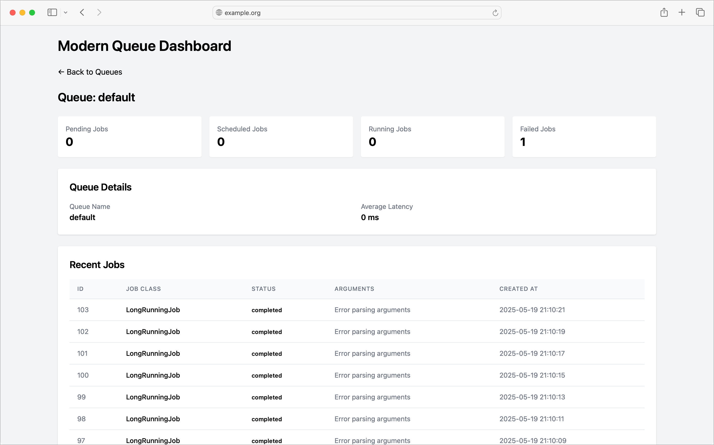

# Modern Queue Dashboard

A mountable Rails engine that provides a clean, Hotwire-powered dashboard for monitoring [Solid Queue](https://github.com/basecamp/solid_queue) jobs. Built with Tailwind CSS, Turbo frames, and Stimulus controllers.



## Features

* High-level metrics - counts for pending, scheduled, running, completed and failed jobs
* Per-queue statistics - job counts and latency metrics
* Job details - arguments, timestamps, state transitions, and error information
* Real-time updates - auto-refreshing metrics via Turbo Stream polling
* Clean UI - responsive interface using Tailwind CSS
* Zero setup - install, mount, and go

## Requirements

* Rails 8.0+
* Ruby 3.3.8+
* Solid Queue 1.1+

## Installation

Add this line to your application's Gemfile:

```ruby
gem "modern_queue_dashboard"
```

And then execute:

```bash
bundle install
```

## Mounting the Dashboard

Add the following to your `config/routes.rb`:

```ruby
Rails.application.routes.draw do
  # ... your other routes

  # Mount the dashboard at /queue-dashboard
  mount ModernQueueDashboard::Engine, at: "/queue-dashboard"
end
```

## Security

The dashboard doesn't include authentication by itself. You should restrict access using your application's authentication system.

### With Devise

```ruby
# In config/routes.rb
authenticate :user, -> { current_user.admin? } do
  mount ModernQueueDashboard::Engine, at: "/queue-dashboard"
end
```

### With Basic Auth

```ruby
# In config/routes.rb
require "authenticated_constraint"

constraints AuthenticatedConstraint.new do
  mount ModernQueueDashboard::Engine, at: "/queue-dashboard"
end

# In lib/authenticated_constraint.rb
class AuthenticatedConstraint
  def matches?(request)
    return false unless request.session[:user_id]
    user = User.find_by(id: request.session[:user_id])
    user && user.admin?
  end
end
```

### With HTTP Basic Auth

```ruby
# In config/routes.rb
mount ModernQueueDashboard::Engine, at: "/queue-dashboard", constraints: lambda { |request|
  ActiveSupport::SecurityUtils.secure_compare(
    ::Digest::SHA256.hexdigest(request.headers["Authorization"].to_s),
    ::Digest::SHA256.hexdigest("Basic #{Base64.encode64("username:password")}")
  )
}
```

## Configuration

You can configure the dashboard by creating an initializer:

```ruby
# config/initializers/modern_queue_dashboard.rb
ModernQueueDashboard.configure do |config|
  config.refresh_interval = 5 # seconds
  config.time_zone = "UTC"
end
```

## Development

After checking out the repo, run `bin/setup` to install dependencies. Then, run `rake test` to run the tests.

## Contributing

Bug reports and pull requests are welcome on GitHub at https://github.com/clayton/modern_queue_dashboard. This project is intended to be a safe, welcoming space for collaboration, and contributors are expected to adhere to the [code of conduct](https://github.com/clayton/modern_queue_dashboard/blob/main/CODE_OF_CONDUCT.md).

## License

The gem is available as open source under the terms of the [MIT License](https://opensource.org/licenses/MIT).

## Code of Conduct

Everyone interacting in the Modern Queue Dashboard project's codebases, issue trackers, chat rooms and mailing lists is expected to follow the [code of conduct](https://github.com/clayton/modern_queue_dashboard/blob/main/CODE_OF_CONDUCT.md).
